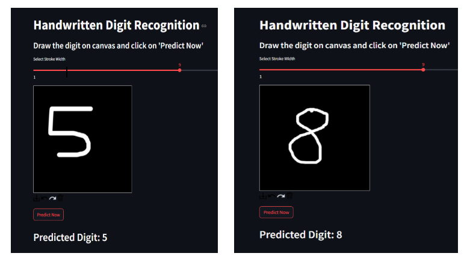

# 🖊️ Handwritten Digit Recognition using Deep Learning and CNN

This project is a web-based application that recognizes handwritten digits (0–9) using a Convolutional Neural Network (CNN). The app is built with **Streamlit** and provides an intuitive interface for users to draw digits and get predictions in real-time.

---

## 🧠 Project Highlights

- Built using **TensorFlow/Keras** for digit classification
- Trained on the **MNIST** dataset
- Live digit input using a drawing canvas
- Instant prediction with confidence scores
- Clean and responsive **Streamlit** interface

---

## 📸 Screenshots

---

## 🛠️ Tech Stack

- **Python**
- **TensorFlow** / **Keras**
- **NumPy**, **Matplotlib**
- **Streamlit** for the web interface
- **PIL (Python Imaging Library)** for image processing

---

